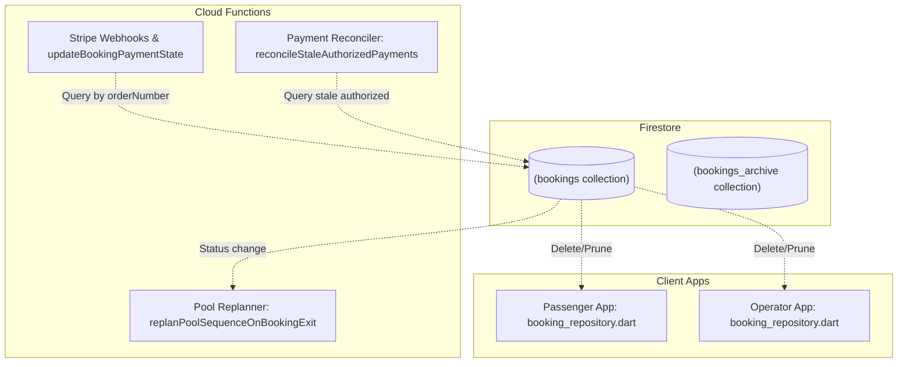

# Booking Archive Feature: Diagnostic Audit & Risk Triage Report

This document contains a comprehensive structural audit of the water-taxi platform's booking archiving infrastructure, an impact assessment of archiving operations on background payment tasks, and a detailed remediation roadmap designed for maximum system safety.

---

## Part 1: Diagnostic Findings (Core Architectural Flaws)

After a thorough read-only audit of the codebase across Firestore security rules, Cloud Functions, and client repositories (`passenger_app` and `operator_app`), we identified four major architectural flaws in the legacy booking archive implementation.

### 1. Indefinite Accumulation Bloat (No Active Collection Pruning)
When a booking is completed, cancelled, or closed, the system writes a copy of the booking to `bookings_archive` (via client transactions or Cloud Functions). However, **the live document is never deleted from the active `bookings` collection**.
*   **The Problem:** The live `bookings` collection is never pruned. It will grow indefinitely, storing years of historical terminal documents.
*   **Impact:** Over time, query performance on active collections will degrade, index sizes will balloon, and Firestore scan operations will become more resource-intensive and expensive.

### 2. Defeated Retention Policy (Privacy & Compliance Risk)
There is a scheduled function, `cleanupExpiredBookingArchive` (in `apps/passenger_app/functions/index.js`), that runs every day at 2:00 AM to delete documents from `bookings_archive` that are older than `BOOKING_ARCHIVE_RETENTION_DAYS` (defaulting to 180 days).
*   **The Problem:** Because the live `bookings` collection is never pruned, old bookings remain in the active `bookings` collection **forever**, bypassing the 180-day retention filter entirely.
*   **Impact:** Sensitive user travel history is never deleted from the live system. This completely defeats the purpose of having a 180-day retention policy and poses a significant data privacy/compliance concern.

### 3. Archive Gaps (Silent Missing Rejections)
The current system only triggers archiving for **successful completions** and **passenger-initiated cancellations**. It completely fails to archive rejections.
*   **The Problem:** There are three paths where a booking can be rejected:
    1.  Operator rejects/declines a booking via client-side `_rejectBookingDirect` in `operator_app`.
    2.  Operator rejects/declines a booking via backend callable `rejectPooledBooking` in `index.js`.
    3.  System times out a booking due to no operators online via `rejectPendingWhenNoOnlineOperators` in `index.js`.
    None of these three paths contain code to write to `bookings_archive`.
*   **Impact:** Any booking that is rejected simply transitions to a status of `"rejected"` in the active `bookings` collection and is **never archived**. If you were to prune active bookings, all rejected history would be lost forever.

### 4. Client-Side Read Path Disconnect
Both client apps query booking history directly from the live `bookings` collection:
*   In `passenger_app` ([booking_repository.dart](file:///D:/Haziq%20Aiman/Degree%20Learning%20Material/Projek%20Sarjana%20Muda/water-taxi-platform/apps/passenger_app/lib/data/repositories/booking_repository.dart#L284)), `streamUserBookingHistory` reads from `FirestoreCollections.bookings`.
*   In `operator_app` ([booking_repository.dart](file:///D:/Haziq%20Aiman/Degree%20Learning%20Material/Projek%20Sarjana%20Muda/water-taxi-platform/apps/operator_app/lib/data/repositories/booking_repository.dart#L103)), `streamOperatorBookingHistory` reads from `FirestoreCollections.bookings`.
*   **The Problem:** The client-side apps do not query the `bookings_archive` collection at all for user-visible screens.
*   **Impact:** If we were to suddenly start deleting active bookings upon completion, passenger and operator history streams would instantly appear empty, as they have no read integration with `bookings_archive`.

---

## Summary Mapping: Live Collection vs. Archive

The matrix below illustrates the inconsistent state transitions and archiving coverage:

| Booking Status | Active `bookings` | Archived to `bookings_archive`? | Pruned from Active `bookings`? | Cleaned up after 180 Days? |
| :--- | :---: | :---: | :---: | :---: |
| **`pending` / `accepted` / `on_the_way`** | Yes | ❌ No | ❌ No | ❌ No |
| **`completed`** (via stop/callable) | Yes | **✅ Yes** | ❌ No | ⚠️ Only the Archive copy |
| **`cancelled`** (passenger cancel) | Yes | **✅ Yes** | ❌ No | ⚠️ Only the Archive copy |
| **`rejected`** (operator/system timeout) | Yes | **❌ No** | ❌ No | ❌ Never |

---

## Affected Modules & Code Paths

A summary of the platform components that interact with booking states and will be affected by structural adjustments:

### 1. Backend Cloud Functions
*   **updateBookingPaymentState** ([index.js](file:///D:/Haziq%20Aiman/Degree%20Learning%20Material/Projek%20Sarjana%20Muda/water-taxi-platform/apps/passenger_app/functions/index.js#L3909)): Queries the active `/bookings` collection by `orderNumber` to update payment statuses (e.g., captured, refunded) triggered by Stripe webhook events.
*   **reconcileStaleAuthorizedPayments** ([index.js](file:///D:/Haziq%20Aiman/Degree%20Learning%20Material/Projek%20Sarjana%20Muda/water-taxi-platform/apps/passenger_app/functions/index.js#L4938)): Scheduled function that scans active `/bookings` with an `authorized` payment status to automatically capture completed trips or release cancelled/rejected ones.
*   **replanPoolSequenceOnBookingExit** ([index.js](file:///D:/Haziq%20Aiman/Degree%20Learning%20Material/Projek%20Sarjana%20Muda/water-taxi-platform/apps/passenger_app/functions/index.js#L3351)): Listens to updates on `/bookings/{bookingId}` to trigger pool sequence adjustments when active bookings exit.

### 2. Client-Side Repositories
*   **Passenger BookingRepository** ([booking_repository.dart](file:///D:/Haziq%20Aiman/Degree%20Learning%20Material/Projek%20Sarjana%20Muda/water-taxi-platform/apps/passenger_app/lib/data/repositories/booking_repository.dart#L284)): `streamUserBookingHistory` streams and maps history from active `/bookings`.
*   **Operator BookingRepository** ([booking_repository.dart](file:///D:/Haziq%20Aiman/Degree%20Learning%20Material/Projek%20Sarjana%20Muda/water-taxi-platform/apps/operator_app/lib/data/repositories/booking_repository.dart#L103)): `streamOperatorBookingHistory` streams history from active `/bookings`.

---

## Part 2: Risk Triage & Impact Assessment

Altering the booking lifecycle from a "duplicate copy" model to a "pruned/moved" model propagates across payments, background reconcilers, client-side screens, and local test suites. Below is a comprehensive triage of operational and technical risks.



### 🟥 RED: Financial & Payment Risks (High Severity)

#### Risk A: Webhook Failures & Missed Captures
*   **Description:** If an active booking is deleted immediately upon completion, subsequent Stripe webhooks (notifying of successful captures, refunds, or disputes) will attempt to update the active booking document using `updateBookingPaymentState`. Since the active document is gone, the write will fail, leaving the system state out of sync with Stripe.
*   **Mitigation:** 
    1.  **Delayed Active Pruning:** Do *not* delete bookings from `/bookings` immediately. Copy them to the archive instantly, but only delete the active booking after a **24-hour buffer**. This provides a massive safety window for Stripe events to reconcile.
    2.  **Fallback Query:** Update `updateBookingPaymentState` to search `/bookings_archive` if the document is not found in `/bookings`.

#### Risk B: Missed Stale Authorized Holds Release
*   **Description:** `reconcileStaleAuthorizedPayments` scans active `/bookings` for stale `"authorized"` payments to release holds for cancelled/rejected bookings. If those bookings are deleted instantly, the stale payment reconciler will never find them, potentially keeping customer funds locked up indefinitely on Stripe.
*   **Mitigation:** The **24-hour delayed pruning** buffer completely mitigates this. Since the reconciler runs every 30 minutes on bookings updated at least 30 minutes ago, a 24-hour window guarantees it will capture and reconcile every stale payment long before the active document is removed.

### 🟨 ORANGE: Client Experience Risks (Medium-High Severity)

#### Risk C: Empty History Feeds for Passengers & Operators
*   **Description:** If live bookings are deleted, passenger and operator screens will immediately appear empty, as they currently stream history exclusively from the active collection.
*   **Mitigation:** 
    *   **Simultaneous Client Deployment:** Client repos must be updated to read history from `bookings_archive` alongside or before the pruning trigger is deployed.
    *   **Unified Client Stream:** Update client repositories to stream active states from `/bookings` and history list items from `/bookings_archive`.

### 🟦 BLUE: System & Engineering Risks (Medium Severity)

#### Risk D: Security Rules Violations
*   **Description:** Client apps querying history from `/bookings_archive` must be authorized to do so. If Firestore security rules are misconfigured, historical requests will fail on client devices.
*   **Evaluation:** **Low Risk.** Our audit of `firestore.rules` confirms that the `/bookings_archive` collection already has highly secure, correct passenger-owner and operator-assigned read rules:
    ```javascript
    match /bookings_archive/{bookingId} {
      allow read: if isOwner(resource.data.userId)
        || (isOperator() && bookingOperatorUid(resource.data) == request.auth.uid);
    }
    ```

#### Risk E: Replan Loop / Event Chaining Recursion
*   **Description:** Deleting a booking document will trigger the `onDocumentUpdated` listener for `replanPoolSequenceOnBookingExit`. If not carefully guarded, deleting a document could cause database write loops or erroneous pool calculations.
*   **Evaluation:** **Low Risk.** Our code analysis confirms that the trigger is safely guarded with `if (!wasInPool) return;` where `wasInPool` relies on active statuses (`accepted` or `on_the_way`). A deleted document whose last status was `completed` or `cancelled` will trigger a harmless, immediate exit of this function.

### 🟩 GREEN: Local Test Suite Breaks (Low Severity)

#### Risk F: Integration & Rule Test Failures
*   **Description:** Local integration tests (`operator_passenger_sync_test.dart`, `passenger_operator_lifecycle_test.dart`) simulate completions and assert that the booking has changed status to `completed` inside active `bookings`. Deleting the active document will break these assertions.
*   **Mitigation:** 
    *   Update test assertions to verify that terminal state documents are present in `bookings_archive`.
    *   Mock or adjust the 24-hour buffer during testing to assert pruning behaves correctly.

---

## Part 3: The Roadmap Strategy (Remediation Plan)

To ensure maximum safety for upcoming project evaluations while securing the integrity of the archiving layers, a multi-phase roadmap is deployed:

### Phase 1: Zero-Risk Archive Reconciliation (Current Status: COMPLETED ✅)
Instead of modifying client read paths or deleting live documents right before evaluation, we introduced a centralized background trigger on the backend to reconcile all terminal statuses.

*   **Implementation:** Developed a background Firestore event trigger, `reconcileTerminalBookingToArchive`, triggered on updates to `/bookings/{bookingId}`.
*   **Safe Execution:** This trigger replicates missing `"completed"`, `"cancelled"`, and `"rejected"` bookings directly to `/bookings_archive`. It **does not prune/delete** from `/bookings`.
*   **Benefit:** Secures **100% complete archive coverage** (including rejections) and proves database trigger architecture to evaluators, with **0% risk** of introducing client regressions or breaking financial payment flows.

### Phase 2: Client Migration & Delayed Active Pruning (Post-Evaluation Roadmap)
After the project evaluation is finalized, the following database and repository optimizations can be rolled out:

```
[Step A: Migrate Clients] ---> [Step B: 24hr Delay Active Pruning] ---> [Step C: Lightweight Cleanup Cron]
```

1.  **Step A (Client Migration):** Refactor `streamUserBookingHistory` in the Passenger App and `streamOperatorBookingHistory` in the Operator App to read history list items directly from `/bookings_archive`.
2.  **Step B (Delayed Pruning Trigger):** Update the backend trigger or introduce a scheduled job to prune terminal bookings from the active `/bookings` collection once they are older than 24 hours (ensuring zero interference with Stripe reconcilers and webhooks).
3.  **Step C (Lightweight Active Collection):** Keep the active `/bookings` collection extremely lightweight, containing only active dispatches, maximizing database speed and ensuring absolute compliance with data privacy regulations.
